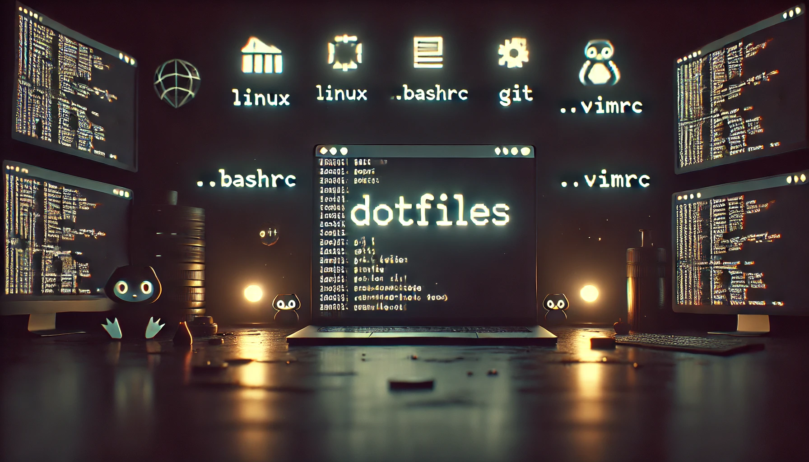

# MY Dotfiles 🎛️💻🛠️



This repository contains my personal dotfiles and an installation script to set up my development environment on a Linux machine. 🐧⚙️🖥️

## Features 🚀✨🛠️

The setup script (install.sh) installs and configures the following essential tools:

- [**Git**](https://git-scm.com/) - Version control system
- [**Zsh**](https://www.zsh.org/) - Shell, set as the default
- [**EZA**](https://eza.rocks/) - Modern replacement for ls
- [**SDKMAN**](https://sdkman.io/) - Java SDK manager
- [**FNM**](https://github.com/Schniz/fnm) - Fast Node.js version manager
- [**UV**](https://docs.astral.sh/uv/) - Python dependency management tool
- [**Starship**](https://starship.rs/) - Customizable shell prompt
- [**Nala**](https://gitlab.com/volian/nala) - Improved package manager frontend for apt
- [**Flameshot**](https://flameshot.org/) - Powerful, yet simple to use screenshot software.
- [**Pomodoro**](https://gnomepomodoro.org/) - A Pomodoro timer for GNOME
- [**Docker Engine**](https://docs.docker.com/engine/install/ubuntu/) - Containerization platform
- [**PIPX**](https://github.com/pypa/pipx) - Python package installer
- [**Sublime Text**](https://www.sublimetext.com/) - Lightweight code editor
- [**Wezterm**](https://wezfurlong.org) - A GPU-accelerated terminal emulator
- [**Zoxide**](https://crates.io/crates/zoxide) - A faster way to navigate your filesystem
- [**Bat**](https://github.com/sharkdp/bat) - A cat clone with wings

## Installation 📥🛠️📌

To set up your system with these configurations, clone the repository and run the installation script: 🖥️🔧📜

```bash
# Download the repository
curl -L -o my_dotfiles.zip https://github.com/mgrb/my_dotfiles/archive/refs/heads/main.zip

# Unzip the repository
unzip my_dotfiles.zip

# Change to the repository directory
cd my_dotfiles-main

# Make the installation script executable
chmod +x install.sh

# Run the installation script
./install.sh
```

## Post-Installation Steps 🔄⚙️📝

After installation, make sure to adjust your Git configuration to match your local user settings and customize `.zsh/config/aliases.zsh` according to your preferences. 🛠️📄✍️

```bash
git config --global user.name "Your Name"
git config --global user.email "your.email@example.com"
```

## Customization 🎨⚙️🖋️

After installation, you can customize the configuration files to fit your workflow. The dotfiles include configurations for Zsh, Git, and other tools. 🖥️✨📂

## My Setup 🖥️🛠️🔧

I follow a few steps after installing my dotfiles to set up my development environment. 🛠️🔧📜

1. Perform a [**clean install of Ubuntu**](#ubuntu-clean-install).
1. Run the [**Debullshit script**](#debullshiting-ubuntu) for Ubuntu.
1. Install [**my dotfiles**](#installation).
1. Configure [**Git settings**](#git-configuration).
1. Set up [**Sublime Text**](#sublime-text).
1. Customize the [**GNOME Terminal**](#gnome-terminal-colors-scheme).
1. Enhance GNOME with some [**extensions**](#gnome-extensions).
1. Finally, install [**my favorite applications**](#my-favorite-applications).

### Ubuntu clean install

I like to install Ubuntu from scratch to have a clean system. I use the minimal installation option and install.

### Debullshiting Ubuntu

I use the following commands to remove all the bloatware that comes with Ubuntu

```bash
sudo bash -c "$(wget -qO- https://raw.githubusercontent.com/polkaulfield/ubuntu-debullshit/main/ubuntu-debullshit.sh)"
```

> **Thanks @polkaulfield:** This script is not mine, I found it [here](https://github.com/polkaulfield/ubuntu-debullshit) and it works well for me.

### Installing my dotfiles

After cleaning up the system, I clone this repository and run the installation script.

Check the [Installation](#installation) section for more details.

### Git configuration

I set up my Git configuration with my name, email and GPG key in the `~/.zsh/config/aliases.zsh` file.

Adjust the aliases file to match your settings.

### Sublime Text

I install the Package Control plugin. After that, I install the package [Colorsublime](https://github.com/Colorsublime/Colorsublime-Plugin) 

I use tehe following settings in my `Preferences.sublime-settings` file:

```json
{
	"ignored_packages":
	[
		"Vintage",
	],
	"theme": "Default Dark.sublime-theme",
	"color_scheme": "Packages/Colorsublime - Themes/GooeyPastel.tmTheme",
	"font_face": "JetBrainsMono Nerd Font",
	"font_options": ["liga"],
	"font_size": 11,
	"rulers": [80, 120],
	"highlight_line": true,
	"caret_style": "phase",
	"line_padding_top": 3,
	"line_padding_bottom": 3,
	"save_on_focus_lost": true,
	"auto_hide_menu": true, 
	"drag_text": false, 
	"bold_folder_labels": true,
	"hot_exit": false,
    "remember_open_files": false,
	"remember_workspace": false,
}
```

### Gnome Terminal colors scheme

I use the [Gogh](https://gogh-co.github.io/Gogh/) script to set up my terminal colors scheme. I use the `Nord` scheme.

```bash
bash -c  "$(wget -qO- https://git.io/vQgMr)" 
```

### Gnome Extensions

I use the following Gnome extensions:

- [Bing Wallpaper](https://extensions.gnome.org/extension/1262/bing-wallpaper-changer/)
- [Compact Top Bar](https://extensions.gnome.org/extension/5669/compact-top-bar/)
- [Frippery Move Clock](https://extensions.gnome.org/extension/2/move-clock/)
- [Tiling Shell](https://extensions.gnome.org/extension/7065/tiling-shell/)
- [Vitals](https://extensions.gnome.org/extension/1460/vitals/)
- [Ubuntu Dock](https://extensions.gnome.org/extension/1300/ubuntu-dock/)

### My favorite applications

- **Dev Tools**
    - [VS Code](https://code.visualstudio.com/): I use the Settings Sync functionality to keep my settings in sync across devices.
    - [DBEaver](https://dbeaver.io/): Database management tool
- **Browsers**
    - [Google Chrome](https://www.google.com/chrome)
    - [Microsoft Edge](https://www.microsoft.com/en-us/edge)
- **Media**
    - [VLC](https://www.videolan.org/): Media player
- **Office & productivity**
    - [OnlyOffice](https://www.onlyoffice.com/): Office suite
    - [ClickUp](https://clickup.com): Project management
    - [ProjectLibre](https://www.projectlibre.com/): Project management
    - [Gnome Pomodoro](https://gnomepomodoro.org/): Pomodoro timer
- **Communication**
    - [Franz](https://meetfranz.com/): Messaging app aggregator (WhatsApp Discord, etc.)
    - [Zoom](https://www.zoom.com/): Video conferencing

#### BONUS: Latex installation

I use [Latex](https://www.latex-project.org/) for my academic work. 
I use the following commands to install Latex on my system:

```bash
sudo apt install texlive-full -y
```

For editing Latex files, I use VS Code with the [LaTeX Workshop](https://marketplace.visualstudio.com/items?itemName=James-Yu.latex-workshop) extension.
